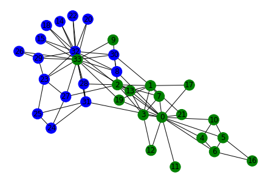

# Kernighan-Lin-Scratch-code-for-graph-partitioning

The above python code will take a network data as input and bisect the graph in such a way that the cut size is minimum.

It uses Kenighan-Lin algorithm for partitioning the graph.

